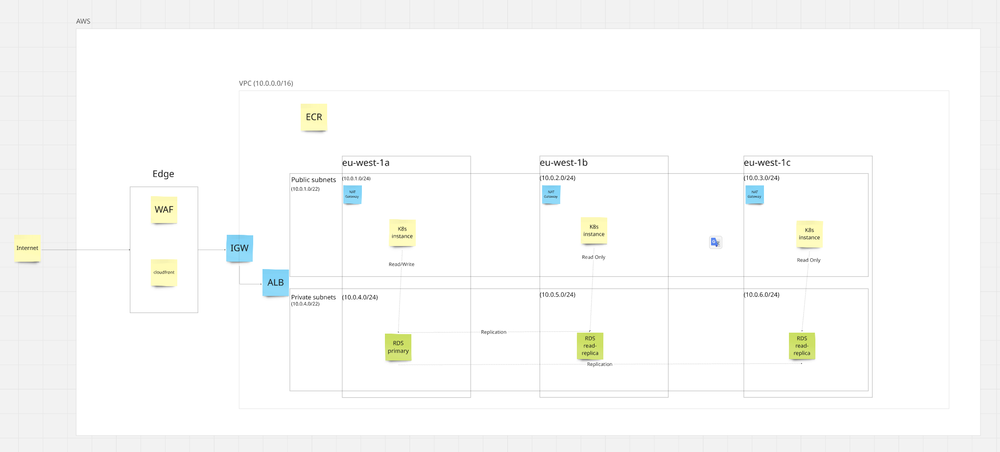

**Suggested Architecture**  

**Prerequisites**  
1. Access to AWS account and CLI (via IAM user access key or OIDC setup)
2. Terraform installed
3. `direnv` installed and configured 

**How to Build and Deploy**  
Current:
* `terraform apply` locally  

**Future**  
* (1.0)Setup ruleset enforcement on `main`
* (1.1)Setup `dev` PR to `main` to autoapply Terraform

**Issues**
1. IP Range allocation in given arch diagram is impossible. AWS only allows VPCs a maximum `/16` which maps to `10.0.0.0 - 10.0.255.255`. There's no way for the private subnet to have the requested IP range and still be within the same VPC. 
2. RDS should have read replicas setup in different AZs
3. RDS Auth should not use user/pass, setup IAM DB Auth instead. In general user/pass should never be used within AWS and all services should be moving to role based short lived token auth. 

**TODO Requirements**  
0.3 Add backend DB  
0.4 Setup ECR  
0.5 Deploy simple app  
1.0 Refactor architecture with security recommendations

**TODO Improvements**  
1.1 Add tf apply GH action on merge to main  
1.2 Add precommit hook secret scanner